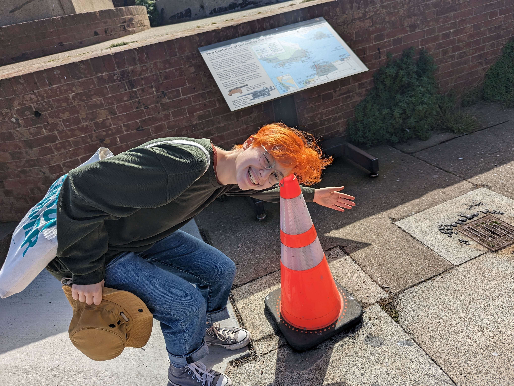

---

title: "Kira Morozova"

subtitle: "Mathematics Major ('26)"

excerpt: "Mathematics Major ('26)"

date: "2024-06-05"
  
# layout options: single or single-sidebar

layout: single-sidebar
links:
- icon: github
  icon_pack: fab
  name: Github
  url: https://github.com/kir-morozov

categories: 
- research students
- research projects

featured: true
draft: false

---

Hometown: Moscow, Russia

Fun fact: I take pictures with a lot of traffic cones, because they’re orange like my hair:) 

Favorite book: The Gray House, by Maryam Petrosyan

In the lab: joined us for the summer research program 2024. Continued research in the lab in Spring 2025 and summer 2025.

-----------------------------------------------------------------

Broader project: [Balancing selection: mechanisms, timescales, and signatures. ](https://bitarellolab.netlify.app/project/balancingselection/)