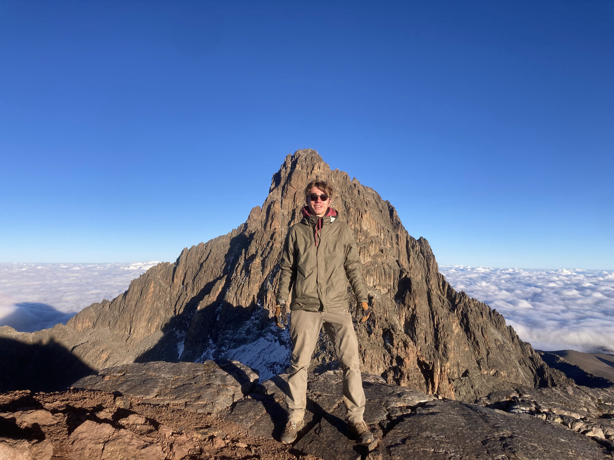

Fun Fact: My favorite Disney-adjacent character is the Iron Giant.

Haverford College Class of 2024 

Anthropology and Biology Major

From Oak Park, Illinois

Fun Fact: My favorite Disney-adjacent character is the Iron Giant.

In the lab: Spring 2023-ongoing, working on phylogenetic signal, phylogenetic methods, and hominin life history evolution. Co-mentured by [Maja Šešelj](https://www.brynmawr.edu/inside/people/maja-seselj).

----------------------------------------------------------------------

