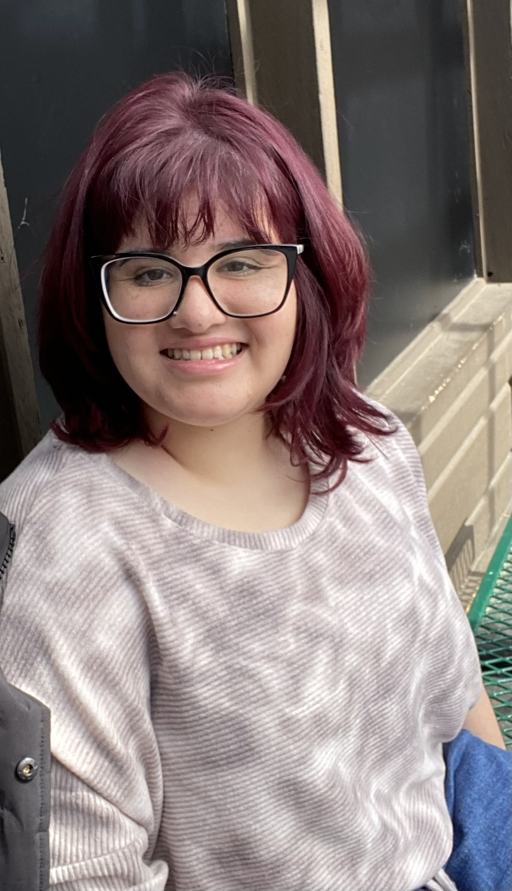

Pronouns: she/her/hers

Hometown: Staten Island, New York

Fun Fact: I have the same birthday as Mick Jagger

In the lab: Worked on R teaching materials with the BMC Digital Scholarship Grant in summer 2023

-----------------------------------------------------------------

